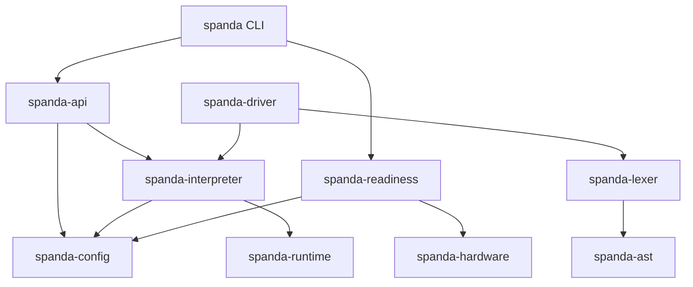

# Dependency Rules

Enforceable dependency governance for Spanda Platform v2.0.

**Parent:** [platform-architecture.md](./platform-architecture.md) · **Matrix:** [module-ownership.md](./module-ownership.md)

---

## Core rule

Every module may depend only on **layers below it** (lower index) or **the same layer** (horizontal composition).

```
Solution Blueprints  (6)
        ↓
    Interfaces       (5)
        ↓
 Platform Services   (4)
        ↓
   Core Platform     (3)
        ↓
 Language Runtime    (2)
        ↓
     Compiler        (1)
        ↓
    Foundation       (0)
```

| Dependency | Allowed? |
|------------|----------|
| Layer 4 → Layer 3 | Yes (downward) |
| Layer 4 → Layer 4 | Yes (same-layer, must stay acyclic) |
| Layer 2 → Layer 4 | **No** (upward) |
| Layer 5 → Layer 0 | Yes |

---

## What counts as a dependency

| Kind | Tracked by |
|------|------------|
| Rust path dependency (`path = "../…"`) | `validate_architecture.py` |
| npm workspace import | Manual review + TS layer map in manifest |
| Blueprint → platform API | Review in blueprint PRs |
| Registry package → provider trait | `spanda-package` resolver |

Only **upward** Rust path dependencies fail CI (unless waived). Same-layer and downward edges are always allowed.

---

## Anti-patterns

| Anti-pattern | Example | Fix |
|--------------|---------|-----|
| Runtime imports API server | `spanda-interpreter` → `spanda-api` | Call through trait at core layer |
| Duplicate entity struct | `RobotRecord` in analysis crate | Use `EntityRecord` from `spanda-config` |
| Blueprint adds workspace crate | New `spanda-warehouse` crate | Use packages + examples only |
| Service owns parsing | `spanda-trust` embeds lexer | Accept AST/program summary from driver |
| Facade in first-party apps | `spanda-cli` → `spanda-core` | Import owning crate directly |

---

## Waiver process

Existing upward dependencies are baselined in `scripts/architecture-manifest.yaml` under `dependency_waivers`. Each waiver has:

- `from` / `to` crate names
- `reason` — why the edge exists today
- `ticket` — tracking ID (`ARCH-xxx`)

**Adding a new waiver** requires:

1. Architecture review (explain why downward refactor is not immediate)
2. Entry in `dependency_waivers` with ticket ID
3. Regenerate `architecture-manifest.json`
4. Note in PR description

**Removing a waiver** is the goal — refactors that eliminate upward edges should remove the corresponding waiver in the same PR.

Current waiver count: see CI output from `validate_architecture.py`.

---

## Circular dependencies

Strongly connected components (SCCs) with more than one crate indicate architectural coupling.

The baseline compile-run-verify SCC (`ARCH-SCC-001`) includes driver, interpreter, readiness, config, transport, and related crates. **No new SCC members** may be added without waiver.

To inspect:

```bash
python3 scripts/validate_architecture.py --verbose
```

---

## Package boundaries

The core workspace stays minimal. New functionality defaults to **registry packages** unless it is:

- Language syntax or semantics
- Compiler functionality
- Runtime execution infrastructure
- Entity infrastructure
- Verification framework contracts
- Core public APIs

Everything else — ROS2, MQTT, vision, SLAM, industry logic — belongs in `packages/registry/`.

See [lean-core.md](./lean-core.md) and [how-packages-work.md](./how-packages-work.md).

---

## TypeScript mirror

The root `src/` tree mirrors lean-core layers. TypeScript modules should follow the same dependency direction:

- `src/parser` must not import from `src/readiness*`
- Platform service mirrors may call core types, not vice versa

Full TS layer map: `scripts/architecture-manifest.yaml` → `typescript_packages`.

---

## Validation commands

```bash
# Full check (CI)
python3 scripts/validate_architecture.py

# Regenerate JSON after manifest edit
ruby -ryaml -rjson -e \
  'puts JSON.pretty_generate(YAML.load_file("scripts/architecture-manifest.yaml"))' \
  > scripts/architecture-manifest.json

# Dependency graph
python3 scripts/validate_architecture.py --write-graph docs/architecture-dependency-graph.dot
```

---

## Dependency graph

Machine-readable graph: [architecture-dependency-graph.dot](./architecture-dependency-graph.dot)

Visual overview (simplified):



Full edge list: 471 path dependencies across 75 workspace crates (see validation output).
