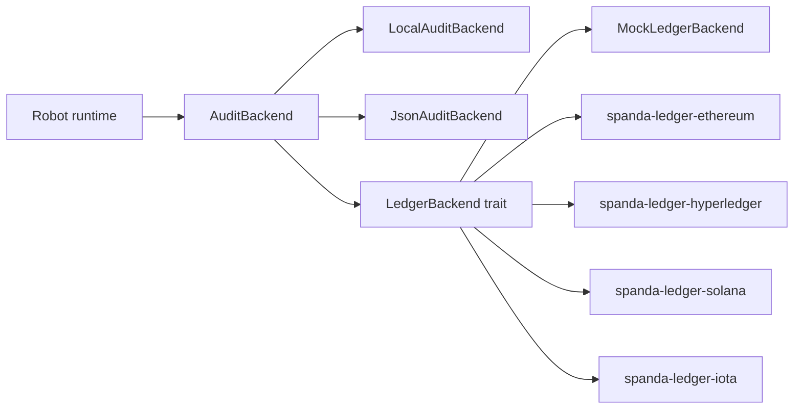

# Future Blockchain Support

**Blockchain is optional in Spanda.** The language core implements audit and provenance abstractions; ledger anchoring is provided by future community packages.

## Architecture



## Trait interfaces (`spanda-audit`)

```rust
trait AuditBackend {
    fn append(record: AuditRecord) -> Result<RecordId>;
    fn verify(record_id: RecordId) -> Result<bool>;
    fn export() -> Result<AuditExport>;
}

trait LedgerBackend: AuditBackend {
    fn anchor_hash(hash: Hash) -> Result<TransactionId>;
    fn verify_anchor(hash: Hash) -> Result<bool>;
}
```

Future packages implement `LedgerBackend` for their chain SDK. The compiler and interpreter **do not** reference chain-specific types.

## Planned community packages

| Package | Import path | Purpose |
|---------|-------------|---------|
| `spanda-ledger` | `ledger.mock` | Mock anchoring (MVP, included in registry stub) |
| `spanda-ledger-ethereum` | `ledger.ethereum` | Ethereum anchoring |
| `spanda-ledger-hyperledger` | `ledger.hyperledger` | Hyperledger Fabric |
| `spanda-ledger-solana` | `ledger.solana` | Solana anchoring |
| `spanda-ledger-iota` | `ledger.iota` | IOTA tangle anchoring |
| `spanda-did` | `identity.core` | Decentralized identifiers |
| `spanda-provenance` | `provenance.core` | Mission provenance helpers |
| `spanda-supply-chain` | `supply_chain.trace` | Hardware supply-chain traceability |

## Allowed uses of blockchain

- **Audit anchoring** — periodic hash commits of audit log roots
- **Supply-chain traceability** — component provenance for hardware modules
- **Device identity** — DIDs and verifiable credentials for fleet devices
- **Tamper-evident mission records** — signed, hash-chained logs with optional on-chain anchors

## Forbidden uses

- **Safety-critical control loops** — no blockchain calls in actuator paths
- **Real-time motion planning** — latency-sensitive paths stay local
- **On-chain actuation** — actuators accept only `SafeAction` from local `safety.validate()`

## Mock ledger today

Programs can anchor audit root hashes via the built-in mock backend:

```spanda
audit.record("mission_tick", robot.pose());
let root = audit.root_hash();
mock_ledger.anchor(root);
mock_ledger.verify(root);
```

This exercises the `LedgerBackend` interface without network access. Replace `mock_ledger` with a package-provided backend when real chain packages ship.

## Related

- [audit-provenance.md](./audit-provenance.md)
- [security.md](./security.md)
- [registry.md](./registry.md)
