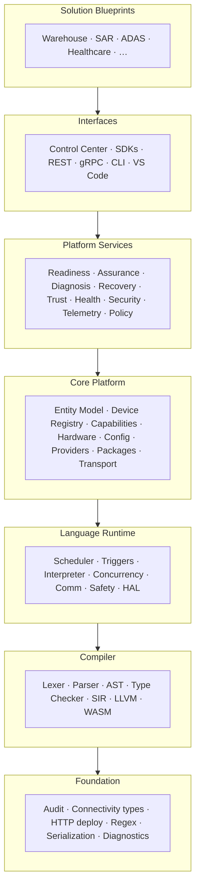

# Spanda Platform Architecture v2.0

Official architecture for the Spanda Autonomous Systems Platform — layered structure, dependency governance, ownership boundaries, and validation tooling.

**Related:** [layered-architecture.md](./layered-architecture.md) · [dependency-rules.md](./dependency-rules.md) · [module-ownership.md](./module-ownership.md) · [design-principles.md](./design-principles.md)

For compiler/runtime pipeline diagrams, see [architecture.md](./architecture.md). For lean-core extraction history, see [lean-core.md](./lean-core.md).

---

## Purpose

Spanda has grown from a language and compiler into a complete autonomous systems platform:

- Language, compiler, runtime, packages, providers
- Entity model, device registry, capability framework
- Readiness, assurance, diagnosis, recovery, trust, health, security
- Telemetry, simulation, replay, policy
- SDKs, Control Center, REST/gRPC APIs, CLI
- Solution blueprints (warehouse, SAR, ADAS, healthcare, …)

Architecture consistency is now as important as adding features. This document establishes the **official platform architecture**, **dependency rules**, and **ownership boundaries** without removing existing functionality or redesigning working components.

---

## Layered model



| Layer | Responsibility | Must not |
|-------|----------------|----------|
| **Solution Blueprints** | Compose existing capabilities for an industry vertical | Introduce new platform features |
| **Interfaces** | Human and machine entry points (CLI, API, SDK, IDE) | Embed domain logic that belongs in services |
| **Platform Services** | Reusable operational services (readiness, trust, telemetry, …) | Duplicate entity model or compiler internals |
| **Core Platform** | Canonical data model, registries, transport, fleet/OTA infrastructure | Implement industry-specific workflows |
| **Language Runtime** | Execute `.sd` programs — scheduler, triggers, interpreter, comm | Own REST APIs or blueprint logic |
| **Compiler** | Parse, type-check, optimize, codegen | Execute live missions or fleet operations |
| **Foundation** | Shared primitives with no platform semantics | Depend on compiler or runtime |

---

## Entity model as canonical foundation

The **Entity Model** (`spanda-config`) is the single canonical data model. Everything in Spanda ultimately derives from `Entity`:

| Specialized entity | Role |
|--------------------|------|
| Robot | Physical or simulated autonomous agent |
| Mission | Operational task with lifecycle and verification |
| Package | Installed Spanda package with provenance |
| Provider | Runtime provider implementation |
| Human | Operator, expert, or team member |
| Device | Hardware node in device tree |
| Fleet | Coordinated group of robots/devices |
| Wearable | Body-worn sensor or display |
| Facility | Building, zone, or site |

No duplicate models (`RobotRecord`, `DeviceRecord`, …) should evolve independently. See [entity-model.md](./entity-model.md).

---

## Service boundaries

Each platform service has a single clear responsibility. See [platform-services.md](./platform-services.md).

| Service | Crate(s) | Responsibility |
|---------|----------|----------------|
| Readiness | `spanda-readiness` | Operational go/no-go |
| Assurance | `spanda-assurance` | Deployment evidence |
| Diagnosis | `spanda-explain`, `spanda-runtime-faults`, `spanda-graph`, `spanda-diff` | Explain failures and impact |
| Recovery | Runtime + readiness hooks | Plan and execute recovery |
| Trust | `spanda-trust` | Confidence and authenticity |
| Health | `spanda-readiness` (entity health), runtime HAL | Operational state |
| Security | `spanda-security`, `spanda-tamper`, `spanda-threat` | Identity, secrets, tamper |
| Telemetry | `spanda-telemetry-store` | Metrics, logs, traces, events |
| Policy | `spanda-policy` | Operational policy evaluation |

---

## Event model

All subsystems publish events on a common schema. See [event-model.md](./event-model.md).

Examples: `EntityCreated`, `HealthChanged`, `ReadinessChanged`, `MissionStarted`, `RecoveryTriggered`, `PackageInstalled`, `TrustUpdated`, `TamperDetected`.

Events underpin telemetry, replay, Control Center, audit, and notifications.

---

## API governance

| Surface | Versioning | Shared models |
|---------|------------|---------------|
| CLI | Semver via `spanda --version` | Entity/readiness JSON mirrors REST |
| REST | `/v1/*` path prefix | `EntityRecord`, readiness reports |
| gRPC | Proto semver (e.g. 1.0.3) | Parity with REST entity RPCs |
| SDKs | crates.io / npm / PyPI semver | Generated from OpenAPI/proto |

Avoid duplicated DTOs — SDKs, REST, and gRPC share entity and readiness payloads.

---

## Blueprint governance

Solution blueprints under `examples/solutions/` **compose** platform capabilities. They must not introduce new platform features. If a blueprint needs a capability, add it to the platform first, then reference it from the blueprint.

---

## Validation and CI

Architecture governance is enforced by `scripts/validate_architecture.py`:

| Check | Behavior |
|-------|----------|
| Module classification | Every workspace crate must appear in `scripts/architecture-manifest.yaml` |
| Layer violations | Upward dependencies fail CI unless listed in `dependency_waivers` |
| Circular dependencies | New strongly connected components fail CI; baseline SCC documented |
| Duplicate entity types | Warn if forbidden types appear outside `spanda-config` |
| Public API docs | Covered by `scripts/validate_documentation.py` |

```bash
# Local validation
python3 scripts/validate_architecture.py --verbose

# Regenerate machine-readable manifest after editing YAML
ruby -ryaml -rjson -e 'puts JSON.pretty_generate(YAML.load_file("scripts/architecture-manifest.yaml"))' \
  > scripts/architecture-manifest.json

# Generate dependency graph (Graphviz)
python3 scripts/validate_architecture.py --write-graph docs/architecture-dependency-graph.dot
dot -Tsvg docs/architecture-dependency-graph.dot -o docs/architecture-dependency-graph.svg
```

Dependency graph artifact: [architecture-dependency-graph.dot](./architecture-dependency-graph.dot).

---

## Migration from lean-core layers

The lean-core refactor (Phases 1–17) established workspace crate boundaries documented in [crates/README.md](../crates/README.md). Platform Architecture v2.0 **extends** that model with:

1. Explicit **platform services** layer above core platform
2. **Interfaces** layer for CLI, API, SDK, IDE
3. **Solution blueprint** governance above interfaces
4. **Enforceable dependency rules** with regression baselines

Known upward dependencies and the compile-run-verify SCC are tracked as waivers (`ARCH-001`–`ARCH-SCC-001`) pending incremental refactors — not blockers for shipping, but **must not grow** without explicit waiver review.

---

## Document map

| Document | Contents |
|----------|----------|
| [layered-architecture.md](./layered-architecture.md) | Layer definitions, rationale, diagrams |
| [dependency-rules.md](./dependency-rules.md) | Allowed edges, waiver process, anti-patterns |
| [module-ownership.md](./module-ownership.md) | Full ownership matrix (crates, packages, blueprints) |
| [platform-services.md](./platform-services.md) | Service responsibilities and boundaries |
| [event-model.md](./event-model.md) | Common event schema and publishers |
| [design-principles.md](./design-principles.md) | Guiding principles for contributors |
