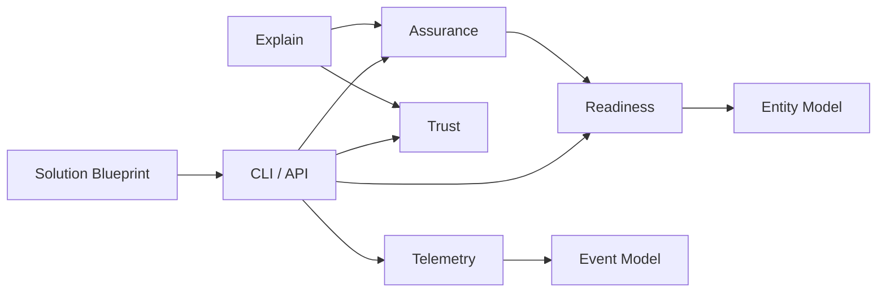

# Platform Services

Clear responsibility boundaries for each Spanda platform service.

**Parent:** [platform-architecture.md](./platform-architecture.md)

---

## Design intent

Platform services are **reusable operational capabilities** consumed by CLI, Control Center, SDKs, and solution blueprints. Each service owns one concern. Overlapping responsibilities create inconsistent reports, duplicated DTOs, and fragile integrations.

---

## Service catalog

### Readiness

| | |
|-|-|
| **Crate** | `spanda-readiness` |
| **Question answered** | Is this entity/system operationally ready? |
| **Outputs** | Weighted go/no-go score, gate failures, mission verification |
| **Entity integration** | `evaluate_entity_readiness`, `verify_entity` |
| **Docs** | [readiness.md](./readiness.md), [entity-readiness.md](./entity-readiness.md) |

Must not: generate compliance PDFs (assurance) or long-form failure narratives (explain).

---

### Assurance

| | |
|-|-|
| **Crates** | `spanda-assurance`, `spanda-contract`, `spanda-score`, `spanda-compliance`, `spanda-chaos`, `spanda-estimate` |
| **Question answered** | What evidence supports safe deployment? |
| **Outputs** | Assurance cases, contract proofs, scorecards, chaos results |
| **Depends on** | Readiness (gate input), capability, hardware |
| **Docs** | [mission-assurance.md](./mission-assurance.md), [assurance-cases.md](./assurance-cases.md) |

Must not: duplicate readiness scoring or operate fleet mesh directly.

---

### Diagnosis

| | |
|-|-|
| **Crates** | `spanda-explain`, `spanda-runtime-faults`, `spanda-decision`, `spanda-graph`, `spanda-diff` |
| **Question answered** | Why did it fail? What changed? What depends on what? |
| **Outputs** | Explainability reports, fault events, decision trails, impact graphs |
| **Docs** | [explainability.md](./explainability.md), [runtime-fault-detection.md](./runtime-fault-detection.md), [root-cause-analysis.md](./root-cause-analysis.md) |

Must not: execute recovery actions (recovery) or set trust scores (trust).

---

### Recovery

| | |
|-|-|
| **Crates** | Runtime reliability hooks + readiness policies (no dedicated crate) |
| **Question answered** | How does the system recover from failure? |
| **Outputs** | Recovery plans, retry/fallback execution, degraded modes |
| **Docs** | [reliability.md](./reliability.md), [recovery-policies.md](./recovery-policies.md), [self-healing.md](./self-healing.md) |

Recovery **plans**; runtime **executes**. Readiness evaluates post-recovery state.

---

### Trust

| | |
|-|-|
| **Crate** | `spanda-trust` |
| **Question answered** | How much confidence in program/system authenticity? |
| **Outputs** | Composite trust score, entity trust reports |
| **Entity integration** | `evaluate_entity_trust` |
| **Docs** | [trust-framework.md](./trust-framework.md), [entity-trust.md](./entity-trust.md) |

Must not: perform tamper sensor fusion (tamper) or readiness gating (readiness).

---

### Health

| | |
|-|-|
| **Crates** | `spanda-readiness` (entity health), `spanda-hal`, runtime watchdogs |
| **Question answered** | What is the current operational state? |
| **Outputs** | Health status, heartbeat events, HAL health |
| **Entity integration** | `evaluate_entity_health` |
| **Docs** | [health-checks.md](./health-checks.md), [entity-health.md](./entity-health.md), [runtime-health.md](./runtime-health.md) |

Must not: replace readiness go/no-go for deployment decisions.

---

### Security

| | |
|-|-|
| **Crates** | `spanda-security`, `spanda-tamper`, `spanda-spoofing`, `spanda-threat` |
| **Question answered** | Are identities, secrets, and communications protected? |
| **Outputs** | Capability tokens, tamper alerts, threat models, spoof detection |
| **Docs** | [security-architecture.md](./security-architecture.md), [tamper-detection.md](./tamper-detection.md) |

Must not: own package resolution or entity registry mutations.

---

### Telemetry

| | |
|-|-|
| **Crate** | `spanda-telemetry-store` |
| **Question answered** | What happened, with what metrics and traces? |
| **Outputs** | Append-only event log, mission traces, OTLP export |
| **Docs** | [telemetry-store.md](./telemetry-store.md), [replay.md](./replay.md) |

Must not: evaluate readiness or render Control Center UI.

---

### Simulation

| | |
|-|-|
| **Crate** | `spanda-interpreter` (sim backend) |
| **Question answered** | How does the mission behave in simulation? |
| **Outputs** | Simulated sensor/actuator data, trace frames |
| **Docs** | [getting-started.md](./getting-started.md) (sim section) |

Simulation is a **runtime mode**, not a separate service crate. Assurance and readiness hooks run during sim when configured.

---

### Replay

| | |
|-|-|
| **Crates** | `spanda-telemetry-store` + interpreter playback |
| **Question answered** | Can we deterministically reproduce a mission? |
| **Outputs** | Frame-by-frame playback, diff against live |
| **Docs** | [replay.md](./replay.md), [mission-time-travel.md](./mission-time-travel.md) |

---

### Policy Engine

| | |
|-|-|
| **Crate** | `spanda-policy` |
| **Question answered** | Do operational policies permit this action? |
| **Outputs** | Policy verdicts, violation events |
| **Docs** | [policy-engine.md](./policy-engine.md) |

Must not: replace safety type system (compiler/runtime) or readiness weights.

---

## Overlap resolution guide

| If two services both… | Owner |
|---------------------|-------|
| Score deployment go/no-go | **Readiness** |
| Produce audit evidence | **Assurance** |
| Explain a failure | **Diagnosis** (explain) |
| Detect tampering | **Security** (tamper) |
| Rate program authenticity | **Trust** |
| Record what happened | **Telemetry** |
| Block an action by rule | **Policy** |

When in doubt, add capability to the **lower** layer service and expose via entity/API — do not fork logic into blueprints.

---

## Control Center aggregation

`spanda-api` aggregates platform services into REST/gRPC endpoints. It does not reimplement service logic — it routes to readiness, config, fleet, telemetry, etc.

See [control-center-api.md](./control-center-api.md).
